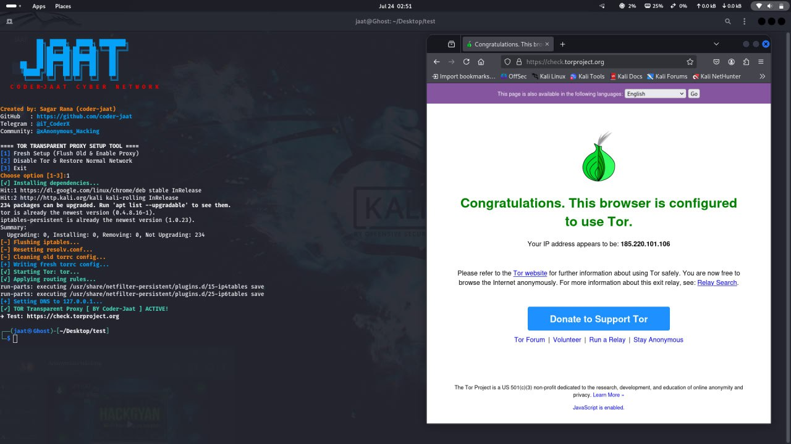
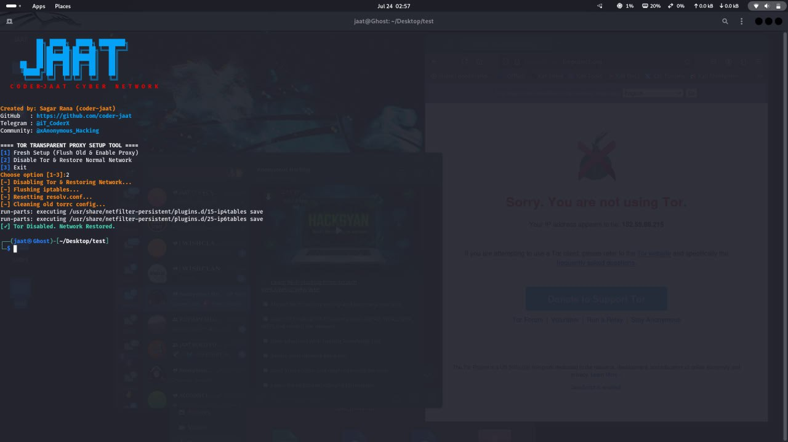

# Proxy
# 🛡️ Coder-Jaat Transparent Proxy Setup Tool

A fully automated **Tor Transparent Proxy Tool** for **Kali Linux** – built with ❤️ by **JAAT CYBER NETWORK**.  
Routes **all system traffic via Tor**, enabling full anonymity using `iptables`, DNS redirection, and auto config healing.

---

## 🔥 Features

- ✅ One-click Tor Transparent Proxy setup
- ✅ Fully flushes old config before applying new
- ✅ Auto-detect & fallback for Tor service
- ✅ DNS redirection via `resolv.conf` & `iptables`
- ✅ Auto-fix if Tor fails (self-healing)
- ✅ Full UI with colored output + JAAT branding
- ✅ Clean shutdown & full restore of original network
- ✅ Built for real-world use on **Kali Linux**

---

## ⚙️ Setup & Run

### 🔹 Option 1: Rename as `Jaat_proxy` (Recommended)

# Clone the tool
```
git clone https://github.com/Coder-Jaat/Proxy.git
```
# Enter directory
```
cd Proxy
```
# Rename script (optional)
```
mv Coder_Proxy.sh Jaat_proxy
```
# Make executable
```
chmod +x Jaat_proxy
```
# Run the tool
```
sudo ./Jaat_proxy
```

### 🔹 Option 2: Rename as `Use Default Script Name`

# Clone the tool
```
git clone https://github.com/Coder-Jaat/Proxy.git
```
# Enter directory
```
cd Proxy
```
# Make it executable
```
chmod +x Coder_Proxy.sh
```
# Run the tool
```
sudo ./Coder_Proxy.sh
```

## 🖥️ Screenshots

### 🔹 Proxy Start (Tool Activated)


### 🔹 Proxy Stop (Network Restored)


---

